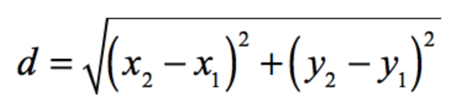

# Projet Pi

## 1. Code

[Lien Github vers notre code hébergé en ligne](https://github.com/sebgranie/pi_project)

### 1.1. Dependences

- **numpy**

J'ai choisi d'utiliser la librairie `numpy` afin de faciliter la manipulation de matrices dans la fonction `generate_all_ppm_files()` spécifiquement lors de la création d'une image initialement blanche.

Installation:

```
pip3 install numpy
```

- **imageio**

Installation:

```
pip3 install imageio
```

- **opencv**

Installation:

```
pip3 install opencv-python
```

- **pylint**

Installation:

```
sudo apt install pylint
```

- **convert**

Installation:

```
sudo apt install graphicsmagick-imagemagick-compact
```

#### 1.3.1 Approximate_pi :

Pour executer le programme de la bonne manière, il est nécessaire de renseigner les arguments tels qu'ils sont indiqués ci-dessous, comme spécifié dans le sujet.

```sh
python3 approximate_pi.py taille_image \
                          nombre_de_points \
                          nombre_chiffre_virgule \
```

Ce projet se divise en l'implémentation d'un module `simulator.py` et d'un programme principal `approximate_pi.py`.

### Module simulator.py :

L'objectif de ce module est de renvoyer une estimation de la valeur de pi, pour cela j'ai appliqué la méthode de Monte-Carlo grâce au module python `random` et de sa méthode `uniform` dans l'intervalle [-1, 1]. Une fois ces points générés, je calcule la distance entre le centre de l'image, de coordonnées (0,0), et chacun de ces points par la formule usuelle: \


Comme le module `simulator.py` est seulemement chargé d'estimer la valeur de pi, j'ai décidé de créer deux listes `list_int` et `list_ext` faisant références à l'ensemble des coordonnées, sous forme de tuples de deux valeurs, des points respectivement à l'intérieur et à l'extérieur du cercle de rayon 1 et de centre (0,0).

Par la méthode de Monte-Carlo nous pouvons prouver qu'en réalisant cette expérience de tirage de points de manière aléatoire sur une surface égale à un quart de cercle encadrée par un carré unité, cela permet d'estimer la valeur `pi/4`. Par conséquent, `simulator.py` renvoie 4 fois la probabilité qu'un point se situe dans chacun des 4 quarts de cercle encadrée donc par un carré de longueur 2 de côté. Cette probabilité vaut le rapport entre le nombre de points dont la distance au centre de l'image est inférieure à un `(len(liste_int))`, divisé par l'ensemble des points tirés.

Une fois la première partie du sujet complétée, j'ai voulu réutiliser le module `simulator.py` afin de réaliser la seconde partie du sujet.

---

## Programme principal approximate_pi.py :

Ce programme se décompose en plusieurs fonctions:

- `validate_all_arguments()`
- `generate_all_ppm_files()`
- `generate_ppm_file()`
- `color_image_with_points()`
- `write_pi_on_image()`
- `generate_gif()`
- `create_or_clean_folder()`

L'objectif est de produire une visualisation de l'état de convergence de l'algorithme de Monte-Carlo pour l'estimation du nombre pi.
Celui-ci est basé sur les estimations successives de pi calculées indépendamment lors de chaque appel du module `simulator.py`, afin de permettre la convergence de ces dernières.
Afin de permettre la convergence de ces estimations, j'ai réalisé une moyenne itérative mise à jour après chaque appel du module `simulator.py` permettant de faire converger les estimations vers la juste valeur de pi.
Pour cela, j'utilise une classe `PiEstimator` permettant d'encapsuler le calcul de pi. Cela me permets de plus, de mieux organiser mon code et que chaque fonction possède un but bien défini. Cela permet notamment à `generate_ppm_file()` de se focaliser sur l'affichage de l'estimation de pi, calculée dans le module `simulator.py` et ainsi alléger les notations au sein de chaque fonction.\

La fonction `validate_all_arguments()` permet de vérifier que les arguments renseignés en entrée de programme sont valides et respectent les conditions souhaitées. La taille de l'image est positive et inférieure à 3840 pixels de côté (équivalent d'une taille d'image 4K). Le nombre de points est strictement positif et est inférieur ou égal à 1e7. Enfin, Le nombre de chiffres après la virgule de pi est compris entre 1 et 7 inclus. L'objectif est de lancer une exception sans l'attraper si une ou plusieurs entrées incorrectes sont données par l'utilisateur sur la ligne de commande.

La fonction `generate_all_ppm_files()` crée l'image à l'aide du module `numpy` sous la forme d'une matrice carrée de taille : `taille_image`. Chaque valeur de la matrice représente un pixel de l'image, sous la forme d'un tuple de 3 valeurs pour utiliser le code couleur RGB. Avant de générer les images ppm ainsi que le gif, j'appelle la fonction `create_or_clean_folder()` qui permet de créer un dossier `out` s'il est inexistant lors de l'exécution du programme `approximate_pi.py`, afin d'y stocker les images et le gif. Si ce dossier `out` existe déjà, il est vidé avant l'exécution du programme pour éviter de stocker les anciennes images ppm des anciennes exécutions. Enfin, on appelle la fonction `generate_ppm_file()` pour générer chacune des images.

La fonction `generate_ppm_file()` récupère l'estimation de pi en appellant `simulator.py`. A l'aide des listes `liste_blue` et `list_pink`, j'appelle la fonction `color_image_with_points()` pour colorer chacun des pixels de l'image en fonction des tirages de points effectués dans le module `simulator.py`. La couleur de chaque pixel sera fonction de sa distance au centre de l'image. Tous les points dont la distance est inférieure à un possède le code RGB suivant : `(0, 0, 255) = bleu`, les autres celui-ci : `(238, 130, 238) = rose`. J'effectue ensuite une copie de l'image me permettant d'écrire le nombre pi sur l'image avant de la sauvegarder au format ppm. Pour écrire le nombre pi, j'appelle la fonction `write_pi_on_image()` qui utilise le module `opencv` pour afficher pi à l'aide de sa partie entière suivie de sa partie decimale.

Enfin, la fonction `generate_gif()` permet, une fois les 10 images ppm créées, grâce au module `subprocess` de convertir ces images en un gif qui est également renvoyé dans le dossier `out`.

J'ai décidé d'utiliser le module `argparse` pour me permettre de renseigner les arguments à spécifier en entrée de programme : `taille_image`, `nombre_de_point` et `nombre_chiffre_virgule`.

---
