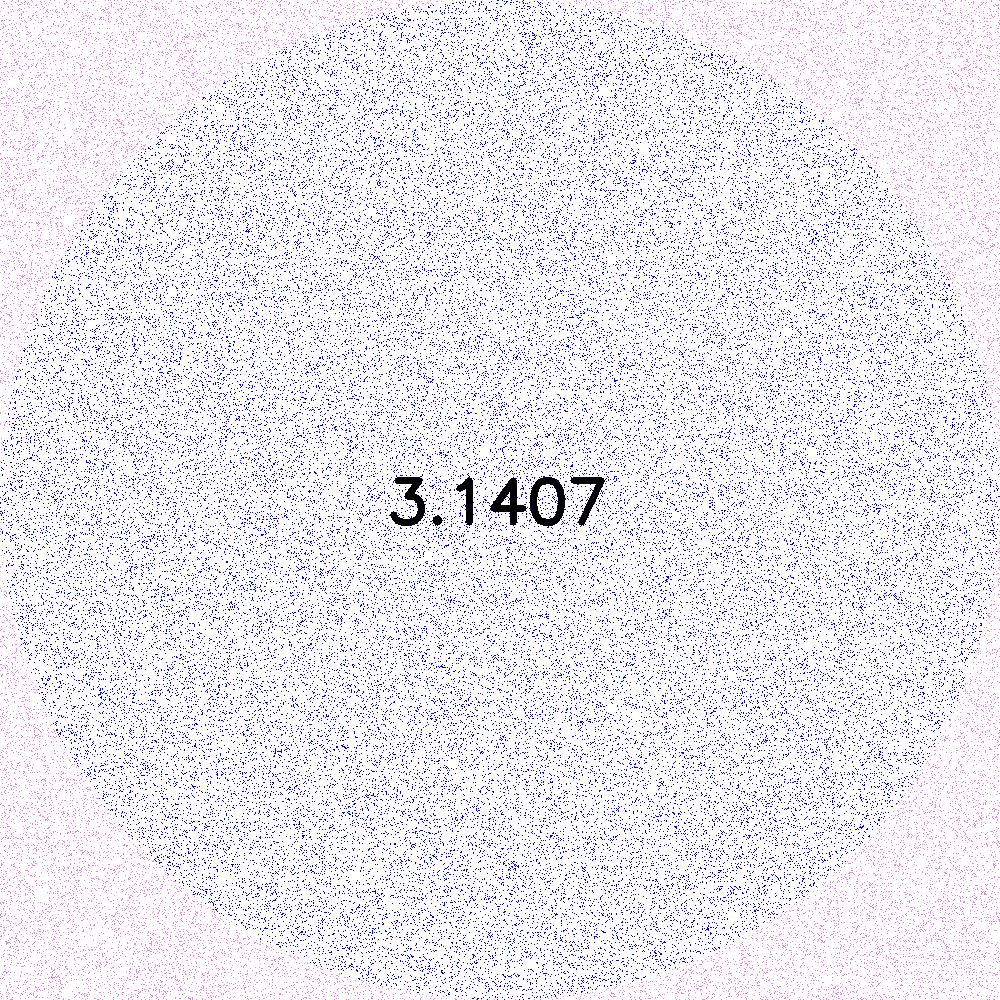

# Projet Pi



## 1. Code

[Lien Github vers notre code hébergé en ligne](https://github.com/sebgranie/pi_project)

### 1.1. Dependences

- **numpy**

J'ai choisi d'utiliser la librairie `numpy` afin de faciliter la manipulation de matrices dans la fonction `generate_all_ppm_files()` spécifiquement lors de la création d'une image initialement blanche.

```
pip3 install numpy
```

- **imageio**

```
pip3 install imageio
```

- **opencv**

```
pip3 install opencv-python
```

- **pylint**

```
sudo apt install pylint
```

- **convert**

```
sudo apt install graphicsmagick-imagemagick-compact
```

#### 1.3.1 Approximate_pi :

Pour executer le programme de la bonne manière, il est nécessaire de renseigner les arguments tels qu'ils sont indiqués ci-dessous, comme spécifié dans le sujet.

```sh
python3 approximate_pi.py taille_image \
                          nombre_de_points \
                          nombre_chiffre_virgule \
```

Ce projet se divise en l'implémentation d'un module `simulator.py` et d'un programme principal `approximate_pi.py`.

### Module simulator.py :

L'objectif de ce module est de renvoyer une estimation de la valeur de pi. Pour cela j'ai appliqué la méthode de Monte-Carlo grâce au module python `random` et de sa méthode `uniform` dans l'intervalle [-1, 1]. Une fois ces points générés, je calcule la distance entre le centre de l'image, de coordonnées (0,0), et chacun de ces points par la formule usuelle de calcul d'une distance entre deux points.

Le module `simulator.py` est seulement utilisé pour estimer la valeur de pi grâce à la génération de points, j'ai alors décidé d'ajouter deux arguments optionnels `list_int` et `list_ext`. Ils permettent de stocker l'ensemble des coordonnées des points sous forme de tuples de deux valeurs. Comme ces deux variables sont passées par références, la fonction appelante pourra les récupérer une fois modifiées.

Par la méthode de Monte-Carlo nous pouvons prouver qu'en réalisant cette expérience de tirage de points de manière aléatoire sur une surface égale à un quart de cercle encadrée par un carré unité, cela permet d'estimer la valeur `pi/4`. Par conséquent, `simulator.py` renvoie 4 fois la probabilité qu'un point se situe dans chacun des 4 quarts de cercle encadrée donc par un carré de longueur 2 de côté. Cette probabilité vaut le rapport entre le nombre de points dont la distance au centre de l'image est inférieure à un `(len(liste_int))`, divisé par l'ensemble des points tirés.
OU
Ce module renvoie ensuite 4 fois la probabilité qu'un point appartienne au cercle de rayon 1 inscrit dans un carré de côté de longueur égale à 2. Je m'appuie pour cela de la `len(liste_int))` et du nombre de points tirés `points`.

Une fois la première partie du sujet complétée, j'ai voulu réutiliser le module `simulator.py` afin de réaliser la seconde partie du sujet.

---

## Programme principal approximate_pi.py :

L'objectif est de produire une visualisation de l'état de convergence de l'algorithme de Monte-Carlo pour estimer la valeur pi.

La fonction `validate_all_arguments()` permet de vérifier que les arguments renseignés en entrée de programme sont valides et respectent les conditions souhaitées :

- La taille de l'image est positive et inférieure à 3840 pixels de côté (supérieure à une définition d'image 4K).
- Le nombre de points est strictement positif et est inférieur ou égal à 1e8.
- Enfin, Le nombre de chiffres après la virgule de pi est compris entre 1 et 7 inclus.

La fonction `generate_all_ppm_files()` commence par l'appel de `create_or_clean_folder()` qui permet de créer un dossier `out` s'il est inexistant lors de l'exécution du programme `approximate_pi.py`. Ce dossier permet de stocker les images et le gif générés. Si ce dossier `out` existe déjà, il est vidé avant l'exécution du programme pour éviter de stocker les anciennes images ppm déjà crées. Ensuite, je crée l'image à l'aide du module `numpy` sous la forme d'une matrice carrée initialisée blanche de taille : `taille_image`. Chaque valeur de la matrice représente un pixel de l'image, sous la forme d'une liste de 3 valeurs pour utiliser le code couleur RGB. Enfin, j'appelle la fonction `generate_ppm_file()` de manière itérative pour générer chacune des 10 images.

J'ai décidé de séquencer `generate_ppm_file()` en plusieurs sous-fonctions chacune responsable d'une tâche spécifique. Je récupère l'estimation de pi en appellant `simulator.py`. A l'aide des listes `list_blue` et `list_pink`, j'appelle la fonction `color_image_with_points()` pour colorer chacun des pixels de l'image en fonction des tirages de points effectués dans le module `simulator.py`. La couleur de chaque pixel sera fonction de sa distance au centre de l'image. Tous les points dont la distance est inférieure à un ont le code RGB suivant : `[0, 0, 255] = bleu`, les autres celui-ci : `[238, 130, 238] = rose`. J'effectue ensuite une copie de l'image me permettant d'écrire le nombre pi sur l'image avant de la sauvegarder au format ppm. Pour écrire le nombre pi, j'appelle la fonction `write_pi_on_image()` qui utilise le module `opencv` pour afficher pi à l'aide de sa partie entière suivie de sa partie decimale. Enfin, je sauvegarde l'image au format ppm grâce au module `imageio`.

Ce programme permet la convergence d'estimations successives de pi calculées indépendemment lors de chaque appel du module `simulator.py`. En effet, j'ai réussi cela grâce au calcul d'une moyenne mise à jour après chaque appel de ce même module. La classe `PiEstimator` encapsule l'agrégation de ces estimations.

à enlever peut-être (ci-dessous)

- L'utilisation de cette classe permet de mieux organiser mon code et que chaque fonction possède un but bien défini. Par conséquent, le module `generate_ppm_file()` se focalise sur le séquençage des étapes principales du programme, c'est à dire sauvegarder une image ppm avec l'estimation correspondante.

Enfin, la fonction `generate_gif()` permet, une fois les 10 images ppm créées, grâce au module `subprocess` de convertir ces images en un gif qui est également renvoyé dans le dossier `out`.

J'utilise le module `argparse` pour me permettre de renseigner les arguments à spécifier en entrée de programme : `taille_image`, `nombre_de_point` et `nombre_chiffre_virgule`. J'ai pris cette décision car c'est un moyen facile pour l'utilisateur de renseigner ces arguments directement en ligne de commande et ce module génère des messages d'aide utilisateur.

Une fois le projet réussi, j'utilise pylint afin de rendre un code qui respecte les normes et conventions utilisées par les développeurs.

---

Les images générées sont sauvegardées au format PPM (Portable PixMap). Pour coder ceci, j'ai affecté à chaque pixel trois nombres (R,G,B) qui coderont le niveau de rouge, de vert et de bleu, chacun par un nombre entre 0 et 255. Chaque pixel sera donc codé sur 3 octets. J'ai choisi l'entête P6 car il me semblait être le plus approprié pour me permettre de respecter la consigne de l'espace memoire occupée par chacune des images (1,9 Mo).

Afin de déterminer la compléxité des programmes de mon projet, j'ai étudié l'ensemble des opérations que j'ai réalisé. En complément de cette première estimation, j'ai testé la durée d'exécution de mon programme en fonction de ses entrées. Dans mon programme `data_graph.py`, j'ai utilisé le module `matplotlib` pour tracer un graphique me renseignant sur la complexité temporelle de mon projet. Il assure que pour une taille d'image donnée, le temps d'exécution varie linéairement `O(n)` en fonction du nombre de points en entrée du programme. Pour un nombre de points donné et une taille d'image qui varie, le programme possède une complexité temporelle linéaire également `O(n)`.
Pour un souci d'optimisation, je pourrai adapter mon programme à une exécution multi-threading me permettant potentiellement de gagner en temps lors de son exécution. Pour le moment l'exécution est centralisée sur un seul coeur avec une utilisation estimée à 150%, soit un thread et demi sur les deux disponibles sur ma machine.
J'ai implémenté le programme `test.py` pour réaliser mes tests pour mesurer la durée d'exécution de mon programme en fonction de ses entrées. Une fois ces données recueillies, le programme `data_graph.py` permets d'afficher un graphique nous rendant compte du niveau de compléxité des modules de mon projet.

## 

Je me suis également intéréssé à l'occupation mémoire de mon projet, pour cela j'ai récupéré les données d'espace mémoire maximum dédiée à mon projet toujours grâce à la commande `/usr/bin/time -v`. J'ai pu constater une évolution linéaire très lente du nombre de kilo octets réservés à l'exécution du programme. J'ai réalisé le graphique suivant démontrant ce réusltat.

## 

Pour améliorer les durées d'exécution de mon programme en cherchant à réduire sa complexité spatiale, je me suis rendu compte que l'empreinte memoire est majoritairement occupée par la gestion des listes `list_blue` et `list_pink`. La solution serait alors de ne pas remplir ces deux listes, passer l'image en argument de `simulator.py` pour que les point tirés soient immédiatement ajoutés en tant que pixel de différentes couleurs.
